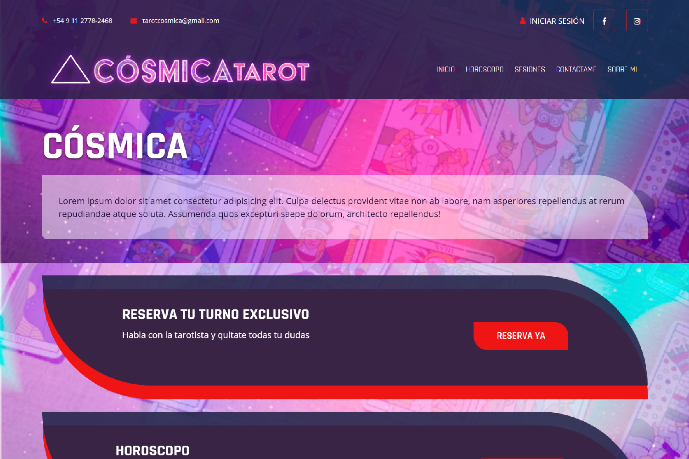

# Cósmica Tarot

#### 📌 Primera página web como desarrollador web freelancer

## Propósito

Página web diseñada para una clienta tarotista en donde el usuario podría reservar turno para tirada de cartas, comunicarse con la profesional y consultar su horoscopo

## DEMO
<a href="https://hkyywk-3000.preview.csb.app/">Demostración</a>

## Skills

                

## Dato

La página es una plantilla web, me ayudo a ahorrar tiempo en el armado y poder retocar a mi manera usando lo necesario.

